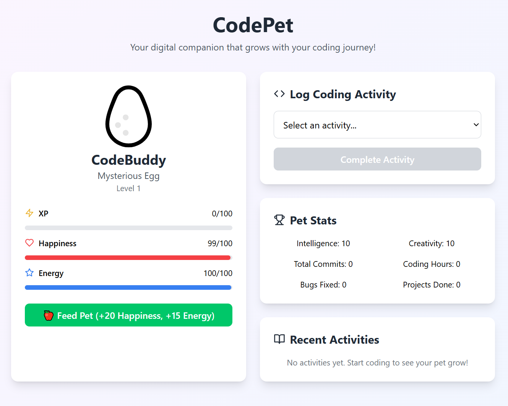

# CodePet 🐣

A digital pet that grows based on your coding habits! Watch your companion evolve from a mysterious egg to a powerful Debug Dragon as you code, commit, and learn.

## Features

- **5 Evolution Stages**: Your pet grows from egg → chick → sparrow → eagle → dragon
- **Activity Tracking**: Log commits, debugging, learning, coding hours, and project completions
- **Real-time Stats**: Monitor your pet's happiness, energy, intelligence, and creativity
- **Gamification**: Earn XP and level up through consistent coding habits
- **Pet Care**: Feed your pet to maintain happiness and energy levels

## Demo



## Getting Started

### Prerequisites

- Node.js (version 14 or higher)
- npm or yarn

### Installation

1. Clone the repository:
```bash
git clone https://github.com/yourusername/codepet.git
cd codepet
```

2. Install dependencies:
```bash
npm install
```

3. Start the development server:
```bash
npm run dev
```

4. Open [http://localhost:3000](http://localhost:3000) to view it in your browser.

## Available Scripts

- `npm run dev` - Start development server
- `npm run build` - Build for production
- `npm run preview` - Preview production build
- `npm run lint` - Run ESLint
- `npm run type-check` - Run TypeScript type checking

## Usage

1. **Log Activities**: Select coding activities from the dropdown and click "Complete Activity"
2. **Watch Growth**: Your pet gains XP and evolves as you log more activities
3. **Maintain Pet**: Feed your pet regularly to keep happiness and energy high
4. **Track Progress**: Monitor your coding stats and pet's development over time

## Activities & XP Rewards

- **Made a commit**: +15 XP, +2 Intelligence
- **Fixed a bug**: +25 XP, +3 Intelligence, +5 Happiness
- **Learned something new**: +30 XP, +5 Intelligence, +3 Creativity
- **Coded for 1 hour**: +20 XP, +3 Intelligence, -10 Energy
- **Completed a project**: +50 XP, +15 Happiness, +5 Creativity, +5 Intelligence
- **Refactored code**: +35 XP, +4 Intelligence, +2 Creativity

## Pet Evolution Stages

1. **Mysterious Egg** 🥚 (Level 1+)
2. **Code Chick** 🐣 (Level 2+)
3. **Script Sparrow** 🐦 (Level 5+)
4. **Code Eagle** 🦅 (Level 10+)
5. **Debug Dragon** 🔥 (Level 20+)

## Technologies Used

- React 18 with TypeScript
- Vite (fast build tool)
- Tailwind CSS
- Lucide React (for icons)
- ESLint + TypeScript ESLint

## Contributing

1. Fork the repository
2. Create your feature branch (`git checkout -b feature/AmazingFeature`)
3. Commit your changes (`git commit -m 'Add some AmazingFeature'`)
4. Push to the branch (`git push origin feature/AmazingFeature`)
5. Open a Pull Request

## Future Features

- [ ] GitHub integration for automatic activity tracking
- [ ] Multiple pet types to choose from
- [ ] Achievement system with badges
- [ ] Social features to compare pets with friends
- [ ] Data persistence with local storage
- [ ] Customizable pet names and appearances
- [ ] Weekly/monthly coding challenges

## License

This project is licensed under the MIT License - see the [LICENSE](LICENSE) file for details.

## Acknowledgments

- Inspired by Tamagotchi and coding gamification concepts
- Icons provided by Lucide React
- Built with love for the coding community

---

**Happy Coding!** 🚀 Remember to feed your pet and keep coding to watch it grow!